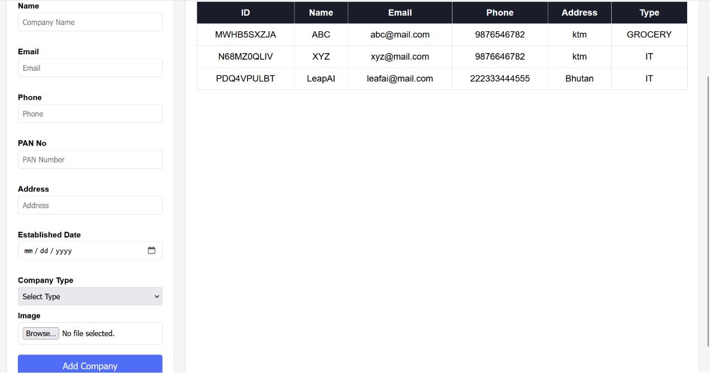
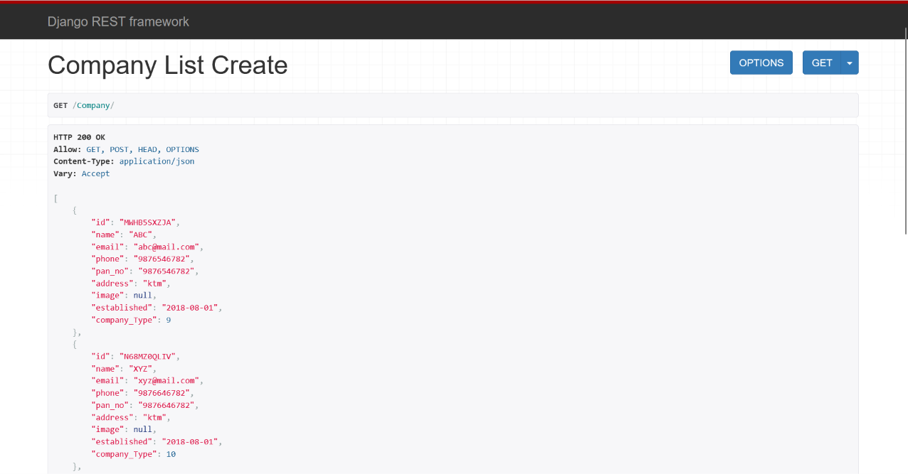

# Company Management System

A Django REST Framework backend with vanilla JS frontend for managing companies.

## Built With

- Django 6.0.3
- Django REST Framework
- SQLite
- HTML, CSS, Vanilla JS

## Features

- Company CRUD API
- Company Type management
- Product, Category, Customer, Orders APIs
- Company UI — list and add companies with real API integration
- Image upload support

## Setup

pip install -r requirements.txt
python manage.py migrate
python manage.py runserver

## API Endpoints

- GET/POST /Company/
- GET /Company/name/
- GET/POST /company_type/
- GET/POST /Product/org_name/
- GET/POST /Category/org_name/
- GET/POST /Customer/org_name/
- GET/POST /Orders/org_name/

## UI Preview

## API Preview

